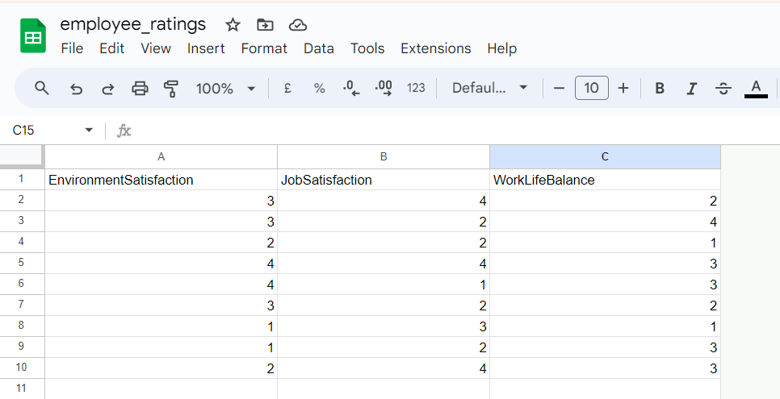
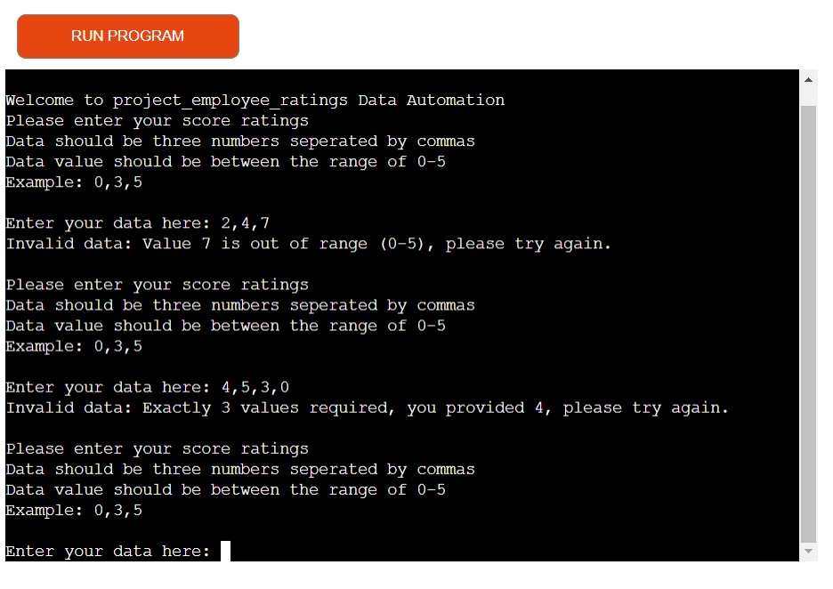
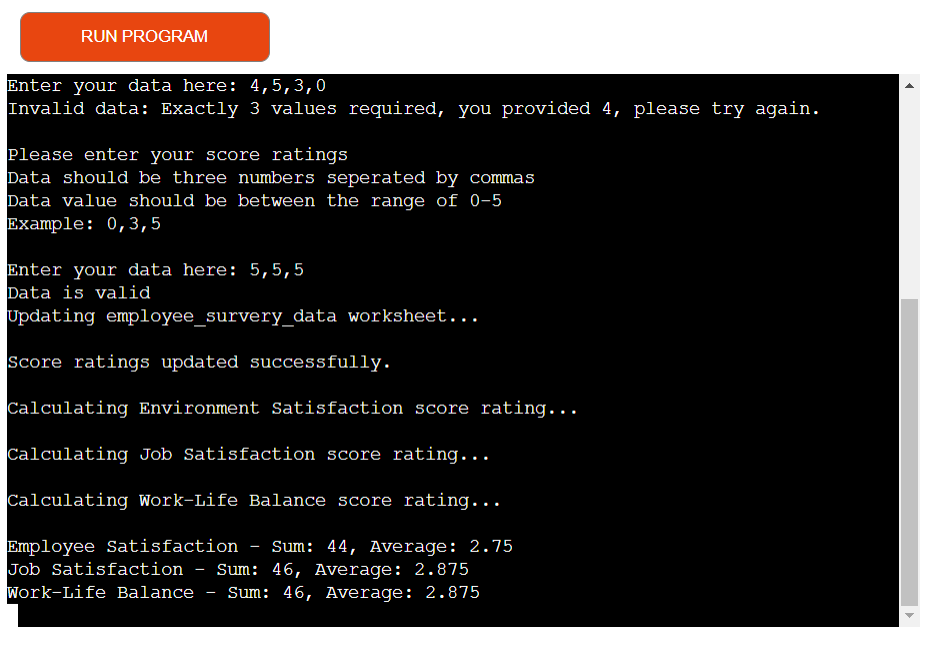

<h1>Project Employee Ratings</h1>

 
 

Project Employee Ratings is a Python backend data automation project that calculates a company's average ratings on three job contentment subjects namely; Environment Satisfaction, Job Satisfaction and Work-Life Balance. The program utilizes a google survey spreadsheet to obtain ratings data on these topics from users atop the spreadsheet, and then use the sum of each of the collated ratings data, to calculate and present the average rating of each subject at the bottom of the spreadsheet. The intent and essence of this project is to give the company a way to know at all times, which area(s) she lags behind and improve on it/them.

<h3>User</h3>
<ul>
<li>As a user, i want to be able to participate in the survey and also glean insights from the survey results.</li>
</ul>
<h3>Site Owner</h3>
<ul>
<li>As a site owner, i want to be able to give external users the opportunity to provide data for the survey.</li>
<li>As a site owner, i want to be able to pinpoint at all times, area(s) for improvement for purposes of building a work environment where employees feel fulfilled.</li>
</ul>
 

<h2>Features</h2>

In achieving the aforementioned project goals, i incorporated the underlisted features.

<h3>Import Structured Data File</h3>

 
 
<ul>
<li>I utilized a csv data set imported from https://www.kaggle.com/ .</li>
<li>To interface with these imported csv data file, I activated firstly, my API Credentials and installed afterwards, two additional dependencies namely; gspread and google-auth.</li>
</ul>
 

<h3>Parse Users Ratings Data</h3>

 
 
<ul>
<li>I created a get_scores_data() function with which i used to achieve this aim. I am also using the get_and_convert_column_to_integers() function to retrieve data in each of the columns to be used for the calculation of their averages.</li>
</ul>
 

<h3>Analyse Users Ratings Data</h3>

 
 
<ul>
<li>I created a validate_data() function with which i used to validate users' inputted ratings data. I also created a - calculate_and_update_average_score_ratings() function - which i have used to calculate the averages of the survey's subjects.</li>
</ul>
 

<h3>Export Results to Appropriate file</h3>

 
 
<ul>
<li>I created a update_worksheet_with_employee_ratings() function which together with the calculate_and_update_average_score_ratings() function, export user ratings data and calculated averages to their respective columns in the spreadsheet.</li>
</ul>
 

<h3>Future Features</h3>
<ul>
<li>Allow users edit inputted values</li>
<li>Allow users completely delete inputted values</li>
</ul>
 

<h2>Technology Used</h2>

<strong>Python</strong>

<ul>
<li>Python programming language is the sole technology used to accomplish this project.</li>
</ul>
 

<h2>Testing</h2>

I manually tested this program to determine it's usability and intuitivity to users by self.

 

<h3>Testing for data input</h3>
<table>
<tr>
    <th>Test</th>
    <th>Outcome</th>
  </tr>
   <tr>
    <td>Are users able to input their ratings data for each subject of the survey?</td>
    <td>Pass</td>
  </tr>
  <tr>
    <td>Are inputted data values added in the second row of the worksheet?</td>
    <td>Pass</td>
  </tr>
</table>
 

<h3>Testing for data validation</h3>
<table>
<tr>
    <th>Test</th>
    <th>Outcome</th>
  </tr>
   <tr>
    <td>Are string values converted to integers?</td>
    <td>Pass</td>
  </tr>
  <tr>
    <td>Are inputted data values exactly three (3)?</td>
    <td>Pass</td>
  </tr>
  <tr>
    <td>Are inputted data values within the range of 0 and 5?</td>
    <td>Pass</td>
  </tr>
</table>
 

<h3>Testing for data parsing and analysis</h3>
<table>
<tr>
    <th>Test</th>
    <th>Outcome</th>
  </tr>
   <tr>
    <td>Is the program able to extract data values from the spreadsheet?</td>
    <td>Pass</td>
  </tr>
  <tr>
    <td>Is the program able to analyse and calculate averages with extracted data values?</td>
    <td>Pass</td>
  </tr>
  <tr>
    <td>Is the program able to update worksheet with calculated averages at the bottom row?</td>
    <td>Pass</td>
  </tr>
</table>
 

<h3>Validator Testing</h3>
<table>
<tr>
    <th>Test</th>
    <th>Outcome</th>
  </tr>
   <tr>
    <td>autopep8</td>
    <td>Pass</td>
  </tr>
</table>
 

<h2>Bugs</h2>

Solved bugs

<ul>
<li>Users' data values kept overriding the title row of the worksheet until I introduced this code: scores_worksheet.insert_row([int(num) for num in data], 2) before the bug could be fixed.</li>
</ul>
 

<h3>Unfixed Bugs</h3>

No unfixed bugs

 

<h2>Deployment</h2>

The project was deployed to Heroku platform using the following steps:

<ul>
<li>Go to Heroku welcome/dashboard page</li>
<li>Click "Create new app"</li>
<li>Fill out the form that pops up with a unique "App name" and select your region -"Europe"</li>
<li>Click "Create app"</li>
<li>On the next page that pops up, click on "Settings"</li>
<li>Scroll down to "Config Vars" and click on "Reveal Config Vars"</li>
<li>In the field for KEY, enter "CREDS"</li>
<li>Go to workspace and copy entire "creds.json" file and paste into the field for VALUE next to KEY</li>
<li>Click on "Add buildpack"</li>
<li>Select "python" and click "save changes"</li>
<li>Click again on "Add buildpack" and select "node.js" followed by "save changes"</li>
<li>On top of the page, click "Deploy" to select a deployment method </li>
<li>Select GitHub</li>
<li>Click "Connect to GitHub"</li>
<li>Search for GitHub repo name, click "search" and then "connect"</li>
<li>Scroll down and select which deployment option you prefer and "DEPLOY"!</li>
</ul>

<h2>Credits</h2>

Credit

<ul>
<li>The Code Institute Love Sandwiches Project code was lifted mostly and used to accomplish this project.</li>
<li>Pieces of code for the project was also taken from numerous youtube channels, https://stackoverflow.com/ and also from the slack network.</li>
</ul>
 
<h2>Acknowledgments</h2>
<h4>Rory Patrick Sheridan</h4>

My mentor under whose tutelage i was able to overcome my anxiety and conclude this project. I also appreciate his immense assistance in pointing me to most materials i utilized for this project.

