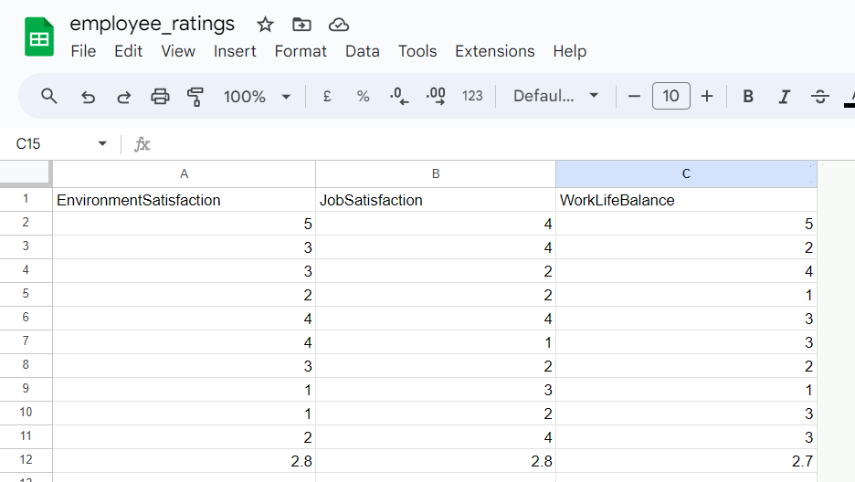

<h1>Project Employee Ratings</h1>

 
 

Project Employee Ratings is a Python backend data automation project that calculates a company's average ratings on three job contentment topics namely; Environment Satisfaction, Job Satisfaction and Work-Life Balance. The program utilizes a google spreadsheet to collate rating data on these three topics from employees, and then use the sum of each of these collated ratings data, to determine their averages. The intent and essence of this project is to give the company a way to know at all times, in which area(s) she lags behind and seek ways to address it/them.

<h3>User</h3>
<ul>
<li>As a user, i want to be able to participate in the employee survey being conducted by my company and provide my ratings data.</li>
</ul>
<h3>Business Owner</h3>
<ul>
<li>As a business owner, i want to be able to give my employeess the opportunity to anonymously rate their job contentment.</li>
<li>As a business owner, i want to be able to pinpoint at all times, area(s) for improvement for purposes of building a work environment where employees feel fulfilled.</li>
</ul>
 